# Proyecto 2: Incident Investigation

**Alumno:** Juan Manuel Cumbrera López

**Curso:** CIBER

**Fecha:** 07/11/2023

 

## Índice

- [Parte 1: Recolección y almacenamiento de evidencias](#parte-1-recolección-y-almacenamiento-de-evidencias)
    - [Recolección de evidencias](#recolección-de-evidencias)
    - [Descripción de las evidencias](#descripción-de-las-evidencias)
    - [Cadena de Custodia](#cadena-de-custodia)
    - [Almacenamiento de las Evidencias](#almacenamiento-de-las-evidencias)
    - [Metodología seguida](#metodología-seguida)

 

## Parte 1: Recolección y almacenamiento de evidencias

### Recolección de evidencias

Tenemos una máquina virtual con sistema operativo Windows 7, la cual ha sido vulnerada. Nos encargan recoger y analizar las evidencias que podamos encontrar, así que para comenzar tendremos en cuenta tres puntos clave según la metodología que seguiremos, que son la volatilidad, el valor relativo probable y el esfuerzo requerido.

Dado que disponemos de una única fuente de evidencia, que es la propia máquina virtual, eso limita los puntos a tener en cuenta a la volatilidad. Dicho esto, optaremos por comenzar la extracción de evidencias haciendo uso de un dispositivo USB 2.0 de 32 GB de espacio, donde hemos depositado las herramientas necesarias.

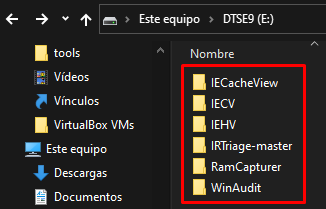

También hemos instalado la herramienta *AccessData FTK Imager* en su versión 3.1.2 en el propio dispositivo USB, de modo que podamos realizar la imagen del disco de la máquina virtual sin alterar las evidencias.

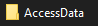

Una vez que tenemos dispuestas las herramientas, conectamos el dispositivo USB a la máquina virtual, y empezamos realizando el triage con la herramienta *IRTriage-Master*, y esto se debe a que esta herramienta es capaz de extraer, entre otras cosas, registros, por lo cual al tener el mayor nivel de volatilidad según la metología propia, resultan ser los datos más prioritarios. Primeramente, rellenamos los datos del caso que nos ocupa.

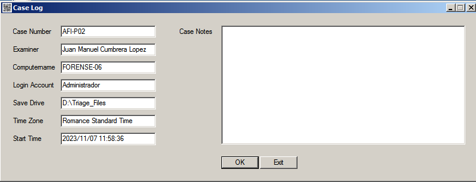

Luego elegimos los datos a extraer, y procedemos con el proceso de triage.

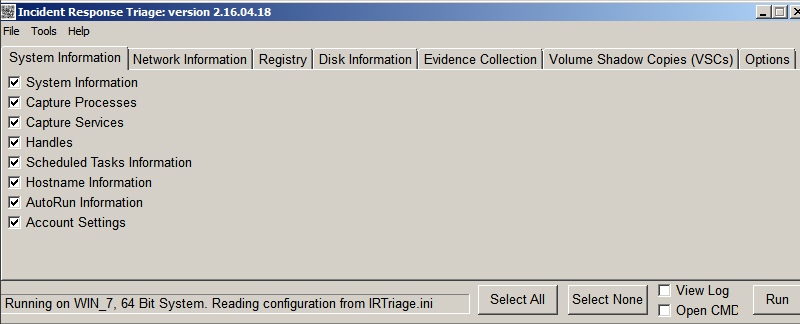

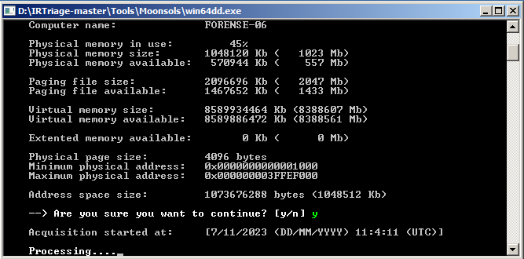

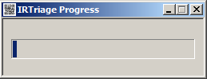

Cuando termina el proceso, podemos ver una carpeta con la fecha y hora de la extracción como nombre, donde tenemos todos los datos extraídos.

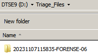

Dentro de dicha carpeta, vemos otra con la colección de evidencias recogidas nombrada como "*Evidence*", donde podremos hallar los registros, logs, además de otros datos importantes del sistema. También vemos unos ficheros en formato txt con información del caso, así como los hashes MD5 y SHA1.

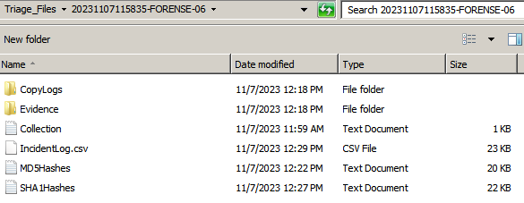

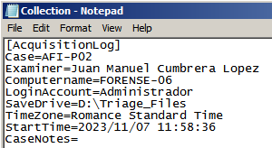

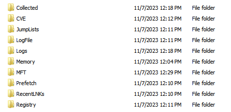

En el orden de volatilidad, de manera inmediatamente inferior, encontraríamos la memoria RAM, cuya imagen obtendremos gracias a la herramienta *Belkasoft Live RAM Capturer*, que nos proporcionará una imagen fidedigna de la memoria RAM. Después de usar este software, hemos usado *AccessData FTK Imager*, ya que este obtiene además una imagen del archivo de paginación, así como un fichero txt con los hashes computados.

**Belkasoft Live RAM Capturer**

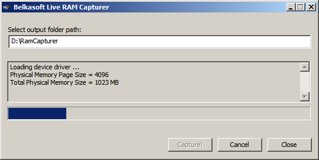

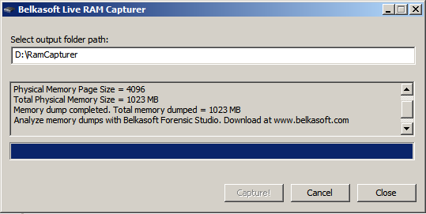

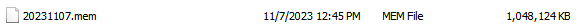

Debido a que esta herramienta no computa los hashes, lo hemos realizado a mano usando *PowerShell*, para guardar posteriormente estos hashes en un archivo txt.

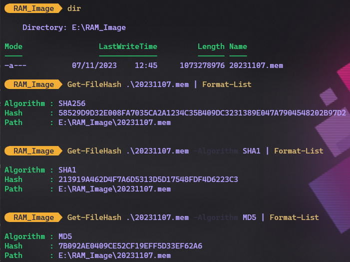

**AccessData FTK Imager**

Con esta herramienta simplemente hacemos clic en la opción de capturar la RAM, y esperamos a que el proceso termine satisfactoriamente. Como mencionamos con anterioridad, este software captura también el archivo de paginación.

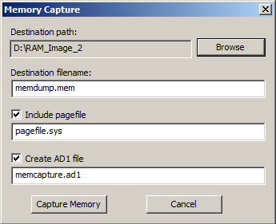

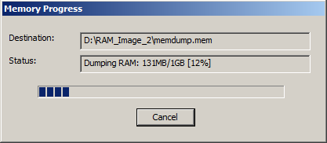

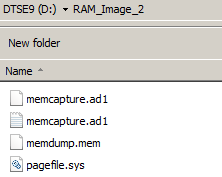

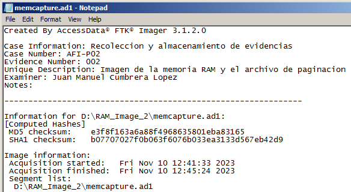

Antes de proceder con la captura del disco, creemos conveniente capturar también la caché, cookies e historial del navegador Internet Explorer de la máquina virtual, y para ello usamos las herramientas *IECacheView*, *IECookiesView* e *IEHistoryView*. Con ellas lograremos obtener y salvar en un fichero txt los datos ya mencionados.

***Caché***

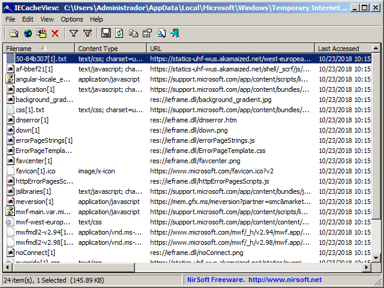

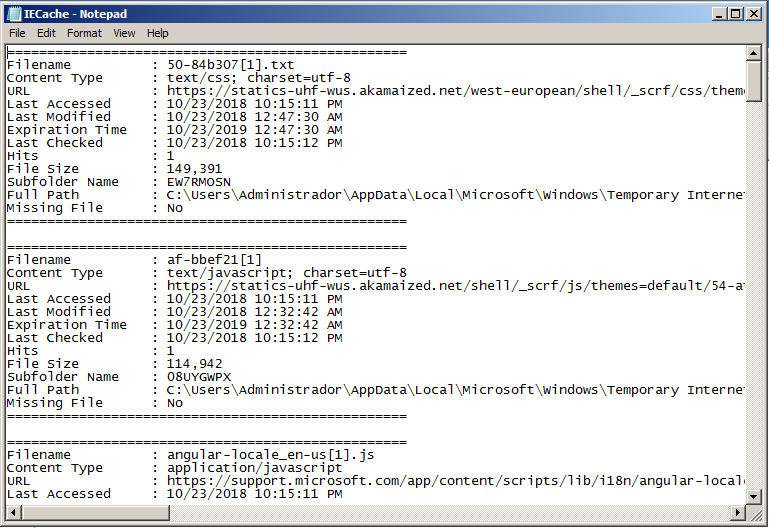

***Cookies***

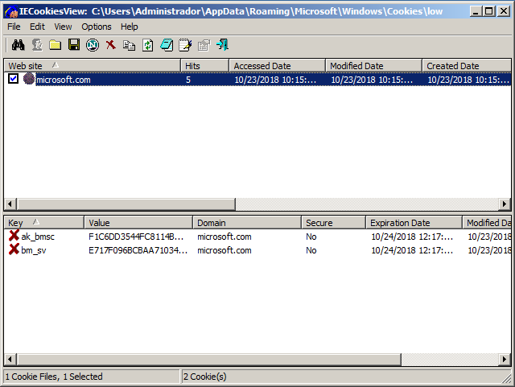

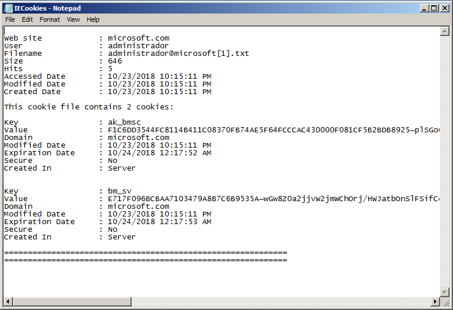

***Historial***

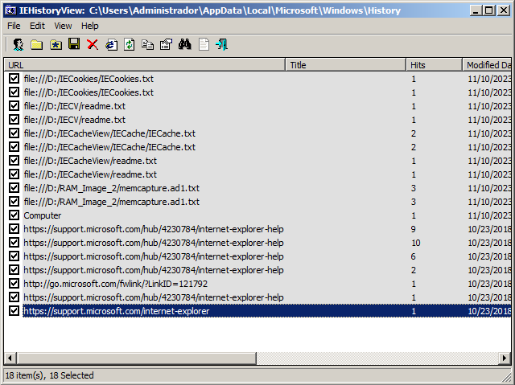

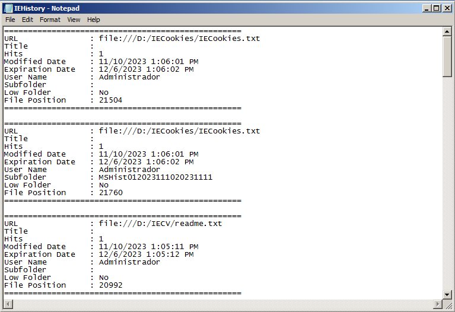

Finalmente, debemos dirigir nuestra atención a la obtención de una imagen del disco de la máquina virtual. Cuando tratamos de llevar a cabo este proceso, nos damos cuenta que nuestro dispositivo USB dispone sólo de 28 GB de espacio, mientras que el disco completo pesa unos 34 GB, nos damos cuenta que tenemos un problema que solucionar. Además, la máquina virtual no admite ningún dispositivo USB superior a 2.0, por lo que intentamos cambiamos la compatibilidad del hardware de la máquina, adaptándolo al USB 3.0, pero no funciona.

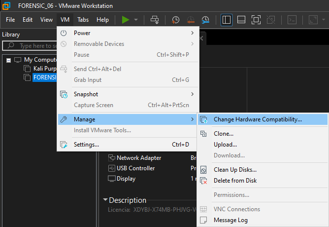

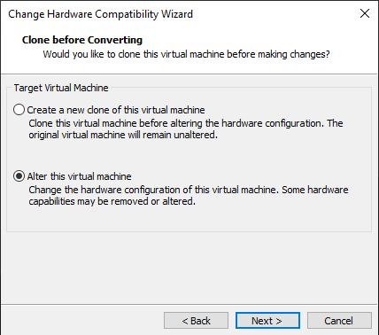

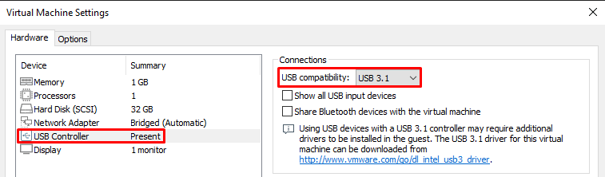

También intentamos instalar un driver que nos permita detectar dispositivos USB 3.0, pero tampoco funciona. Sumado a esto, ni falta hace mencionar que todos los dispositivos USB de los que disponemos son 3.0, por lo que no teníamos nada que hacer. 

Entonces borramos la máquina y la instalamos otra vez, para comenzar con una máquina limpia y sin alterar, y realizamos los pasos anteriores sin problemas. Finalmente, llegamos a la solución, y es usar la herramienta *AccessData FTK Imager*, dado que ésta permite aplicar un gran nivel de compresión a las imágenes, por lo que podríamos obtener la imagen del disco dentro del dispositivo USB 2.0 original soin ningún problema. 

Dicho esto, comenzamos con la extracción de la susodicha imagen.

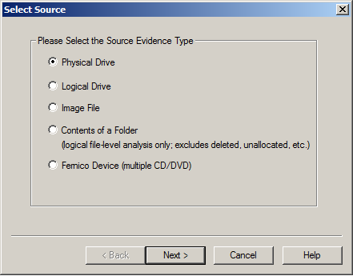

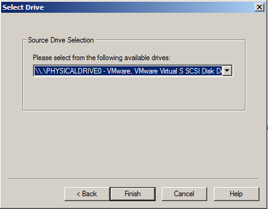

Elegimos el formato **E01** debido a que éste permite aplicar niveles de compresión a la imagen obtenida.

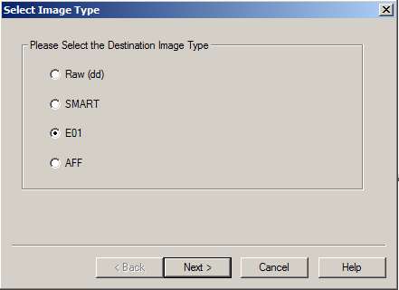

Luego rellenamos los datos del caso y elegimos el nivel de compresión 9, que es el máximo, no sin antes darle un nombre a la imagen que obtendremos.

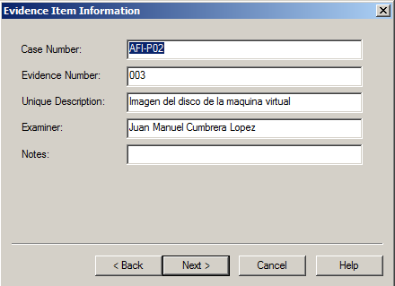

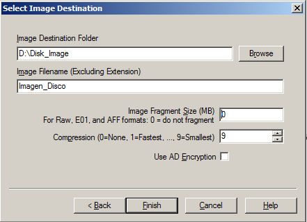

También elegiremos como carpeta de destino una que creamos dentro del dispositivo USB, con el objetivo de no alterar el disco de la máquina virtual.

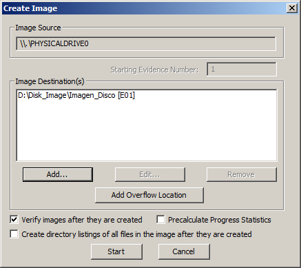

Terminados estos pasos, comienza la obtención y compresión de la imagen.

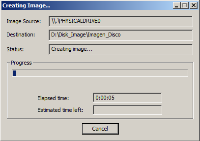

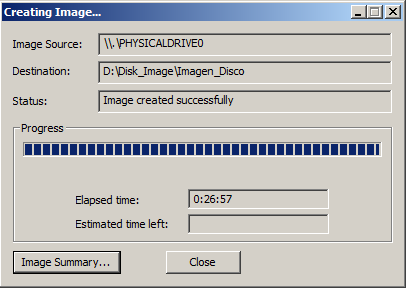

Finalmente logramos adquirir la tan deseada y necesaria imagen del disco duro, con su consiguiente archivo en formato txt, con información acerca de la extracción, así como los hashes computados.

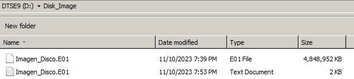

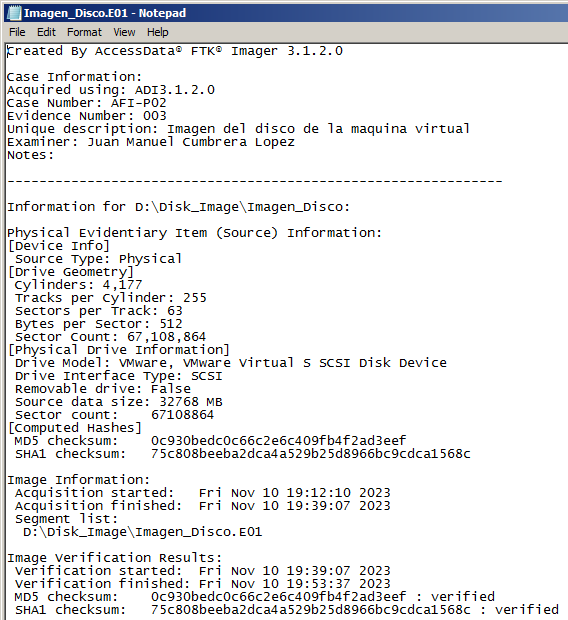

Con este método hemos conseguido una imagen de 4,8 GB de un disco duro de 34 GB, lo que nos ahorra mucho espacio.

 

### Descripción de las evidencias

- ***Archivos del Triage:*** Haciendo uso de la aplicación *IRTriage-Master*, logramos extraer una gran cantidad de datos clave del sistema operativo del cual estamos extrayendo las evidencias. Entre estos datos hallamos registros, información del sistema, de la red y del disco.

- ***Imagen de la memoria RAM:*** Se ha adquirido una imagen de la memoria RAM a través de la herramienta *AccessData FTK Imager 3.1.2*. El formato elegido ha sido el .E01, el cual permite una imagen de disco forense que captura una copia bit a bit de todos los datos almacenados en un dispositivo. 

- ***Imagen del archivo de paginación:*** Además de capturar una imagen de la memoria RAM, la herramienta FTK Imager nos permite obtener también una imagen del archivo de paginación, que es usado por los sistemas Windows como un espacio de almacenamiento en el disco utilizado para gestionar la memoria RAM cuando esta se llena.

- ***Cache de Internet Explorer:*** Es un espacio de almacenamiento temporal en la que el navegador guarda copias locales de páginas web imágenes y otros recursos, a fin de poder cargar dichas páginas más rápido.

- ***Cookies de Internet Explorer:*** Son pequeños archivos de texto que una página web envía al navegador de un usuario, con datos sobre su perfil y comportamiento de navegación en las páginas.

- ***Historial de Internet Explorer:*** Registro que almacena las direcciones web visitadas desde un tiempo hasta la actualidad.

- ***Imagen del disco duro:*** Consiste en una copia bit a bit de la totalidad de los datos almacenados en un dispositivo de almacenamiento, en este caso, del disco duro de la máquina virtual.

 

### Cadena de Custodia

- La evidencia es descargada, analizada y recolectada por Juan Manuel Cumbrera López, entre el 7 y el 10 de noviembre de 2023. Este proceso de adquisición de pruebas digitales tiene lugar en el domicilio de la persona nombrada, en la ciudad de San Fernando, en la provincia de Cádiz.

- Una vez finalizado el proceso de recolección de evidencias, la persona con nombre Juan Manuel Cumbrera López, ha procedido a empaquetarlas en un archivo comprimido zip, de 6,17 GB de espacio. Esta acción ha tenido lugar el día 10 de noviembre del año 2023, en el domicilio de Juan Manuel, en San Fernando, provincia de Cádiz.

- La custodia de la evidencia ha sido llevada a cabo por Juan Manuel Cumbrera López, subiendo el archivo zip a su Google Drive personal. También posee una copia de las evvidencias en el ordenador de trabajo. Estas evidencias estarán subidas al Google Drive hasta que sean transferidas al profesor, que las recibirá descargándolas del sitio web.

 

### Almacenamiento de las Evidencias

El almacenamiento de las evidencias se ha llevado a cabo del siguiente modo, procediéndose a comprimir la totalidad de las evidencias en un archivo de formato zip, con un tamaño de 6,17 GB. Este archivo se ha almacenado en el ordenador de trabajo de Juan Manuel Cumbrera López, además de subirse al Google Drive de este.

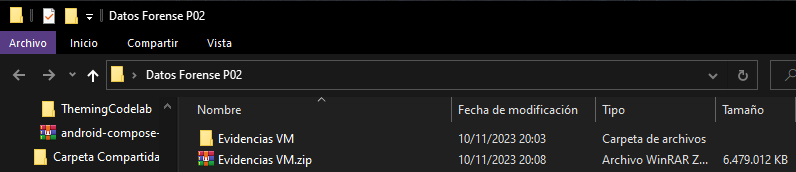

**Link a las evidencias:** https://drive.google.com/file/d/1a6MRXnL_wXifTik3QzghSvy-6XzAf7J_/view?usp=drive_link

 

### Metodología seguida

Se ha seguido una metodología propia desarrollada para la eficiente labor de identificación, adquisición y preservación de pruebas informáticas en el ámbito de la forensia digital. 

Esta metodología consta de una serie de fases bien definidas, con el objetivo de realizar la labor forense de una forma organizada y estructurada. Estas fases consisten en:

1. **Identificación de Evidencia:** PEn esta fase se identifican los elementos que puedan contener evidencia digital, pero puesto que ya se nos suministra una máquina virtual con las pruebas a recabar, no es necesario proseguir con esta fase.
2. **Adquisición:** Como explicamos con anterioridad, en esta etapa de la metodología tenemos en cuenta tres puntos clave para determinar la importancia de las evidencias a recoger, y el orden en el que llevar esto a cabo. Estos puntos consisten en el valor relativo probable, el esfuerzo requerido y la volatilidad de los datos. En nuestro caso, como sólo tenemos una fuente de evidencia, que es la máquina virtual Windows 7, sólo tenemos que tener en cuenta la volatilidad, y es ese es orden que hemos seguido en la extracción y adquisición de las evidencias.
3. **Preservación:** En el caso que nos ocupa, hemos tenido que preservar la evidencia en un archivo comprimido en formato zip, en el Google Drive personal. Sabemos que esta no es la forma más adecuada de preservar y transmitir evidencias, pero ha sido necesario en esta ocasión.
4. **Documentación:** Se ha documentado todo el procedimiento de forma detallada y concisa, a fin de establecer una línea temporal clara de recogida de evidencias. Esto además garantiza que las pruebas no han sido alteradas o modificadas.
5. **Análisis:** Aún no se ha llevado a cabo el análisis de las evidencias.
6. **Presentación:** Para poder presentar un informe pericial con la totalidad del proceso de análisis de las pruebas, dichos análisis deben llevarse a cabo.