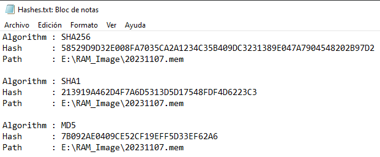

# Proyecto 2: Incident Investigation

**Alumno:** Juan Manuel Cumbrera López

**Curso:** CIBER

**Fecha:** 07/11/2023

 

## Parte 1: Recolección y almacenamiento de evidencias

### Recolección de evidencias

Tenemos una máquina virtual con sistema operativo Windows 7, la cual ha sido vulnerada. Nos encargan recoger y analizar las evidencias que podamos encontrar, así que para comenzar tendremos en cuenta tres puntos clave según la metodología que seguiremos, que son la volatilidad, el valor relativo probable y el esfuerzo requerido.

Dado que disponemos de una única fuente de evidencia, que es la propia máquina virtual, eso limita los puntos a tener en cuenta a la volatilidad. Dicho esto, optaremos por comenzar la extracción de evidencias haciendo uso de un dispositivo USB 2.0 de 32 GB de espacio, donde hemos depositado las herramientas necesarias.

También hemos instalado la herramienta *AccessData FTK Imager* en su versión 3.1.2 en el propio dispositivo USB, de modo que podamos realizar la imagen del disco de la máquina virtual sin alterar las evidencias.

Una vez que tenemos dispuestas las herramientas, conectamos el dispositivo USB a la máquina virtual, y empezamos realizando el triage con la herramienta *IRTriage-Master*, y esto se debe a que esta herramienta es capaz de extraer, entre otras cosas, registros, por lo cual al tener el mayor nivel de volatilidad según la metología propia, resultan ser los datos más prioritarios. Primeramente, rellenamos los datos del caso que nos ocupa.

Luego elegimos los datos a extraer, y procedemos con el proceso de triage.

Cuando termina el proceso, podemos ver una carpeta con la fecha y hora de la extracción como nombre, donde tenemos todos los datos extraídos.

Dentro de dicha carpeta, vemos otra con la colección de evidencias recogidas nombrada como "*Evidence*", donde podremos hallar los registros, logs, además de otros datos importantes del sistema. También vemos unos ficheros en formato txt con información del caso, así como los hashes MD5 y SHA1.

En el orden de volatilidad, de manera inmediatamente inferior, encontraríamos la memoria RAM, cuya imagen obtendremos gracias a la herramienta *Belkasoft Live RAM Capturer*, que nos proporcionará una imagen fidedigna de la memoria RAM. Después de usar este software, hemos usado *AccessData FTK Imager*, ya que este obtiene además una imagen del archivo de paginación, así como un fichero txt con los hashes computados.

**Belkasoft Live RAM Capturer**

Debido a que esta herramienta no computa los hashes, lo hemos realizado a mano usando *PowerShell*, para guardar posteriormente estos hashes en un archivo txt.

**AccessData FTK Imager**

Con esta herramienta simplemente hacemos clic en la opción de capturar la RAM, y esperamos a que el proceso termine satisfactoriamente. Como mencionamos con anterioridad, este software captura también el archivo de paginación.

Antes de proceder con la captura del disco, creemos conveniente capturar también la caché, cookies e historial del navegador Internet Explorer de la máquina virtual, y para ello usamos las herramientas *IECacheView*, *IECookiesView* e *IEHistoryView*. Con ellas lograremos obtener y salvar en un fichero txt los datos ya mencionados.

***Caché***

***Cookies***

***Historial***

